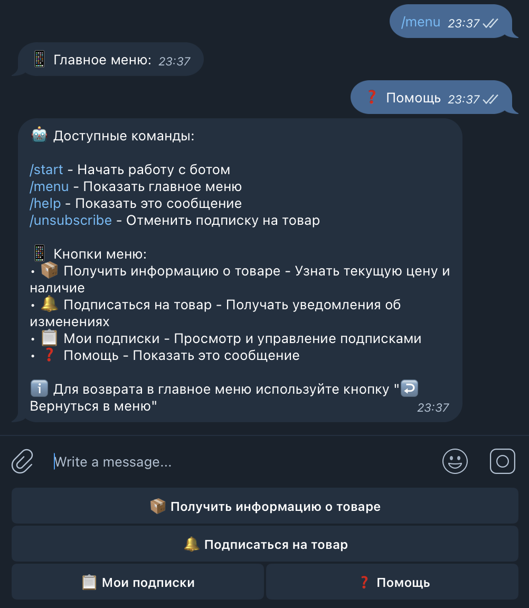
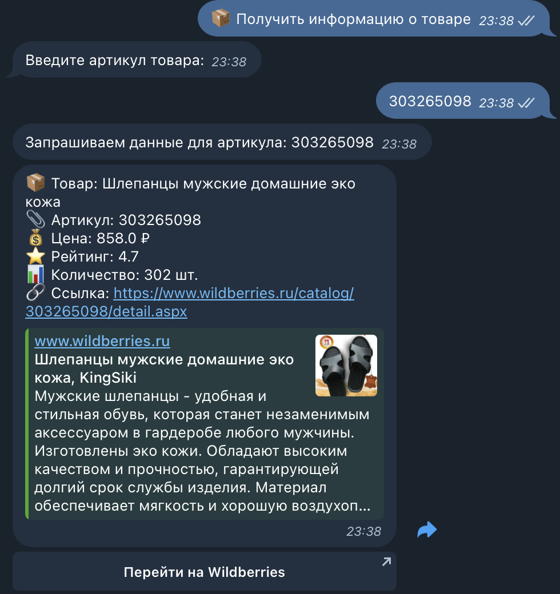
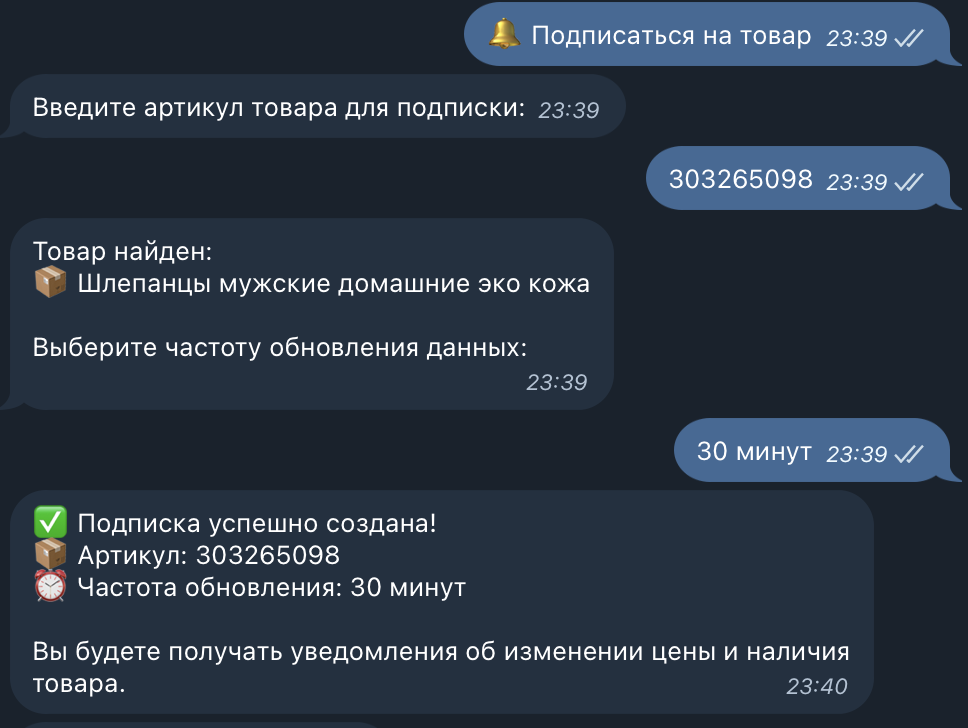
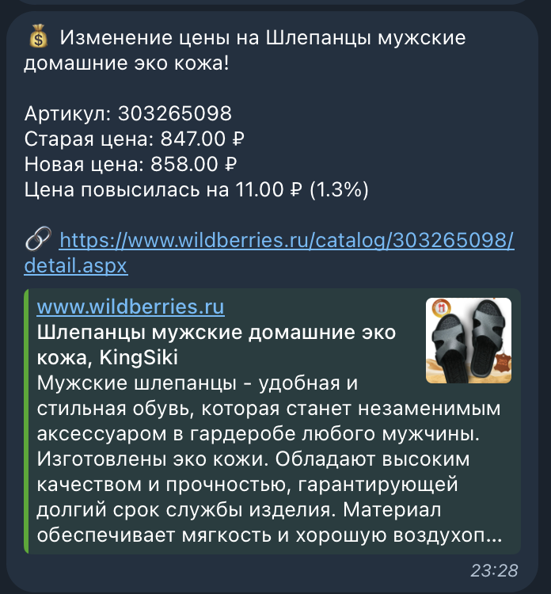

# WbParser - Wildberries Product Tracker

Сервис для отслеживания цен и наличия товаров на Wildberries с уведомлениями через Telegram.

## 🚀 Возможности

- 📦 Получение информации о товарах по артикулу
- 🔔 Подписка на изменение цены и наличия товаров
- 📊 Отслеживание истории изменения цен
- 📱 Уведомления через Telegram
- ⚡ Настраиваемая частота проверки (от 1 минуты до 24 часов)
- 🔄 Автоматическое обновление данных
- 📈 Административная панель для мониторинга

## 🏗️ Архитектура

Проект состоит из двух основных сервисов:

1. **API Сервис** (порт 8888)
   - Основной бэкенд для работы с данными
   - База данных PostgreSQL
   - REST API для управления подписками и товарами
   - Планировщик задач для обновления данных
   - Административная панель

2. **Telegram Bot** (порт 8889)
   - Интерфейс взаимодействия с пользователем
   - Обработка команд и подписок
   - Отправка уведомлений

## 📋 Требования

- Python 3.9+
- PostgreSQL
- Docker и Docker Compose

## 🛠️ Установка и запуск

1. Клонируйте репозиторий:
```bash
git clone https://github.com/Mishazx/WbParser.git
cd WbParser
```

2. Переименуйте файл `.template.bot.env` в `.bot.env` а так же `.template.env` в `.env` и заполните их:
`.env`
```env
# API Service
POSTGRES_DB=database
POSTGRES_USER=postgres
POSTGRES_PASSWORD=postgres
```

`.bot.env`
```env
# Telegram Bot
BOT_TOKEN=token123123:token_telegram_bot
API_TOKEN=token123123 (брать из админки)
```

3. Запустите сервисы через Docker Compose:
```bash
docker-compose up -d
```

## 🤖 Использование Telegram бота

1. Найдите бота в Telegram по имени: `@your_bot_name`
2. Нажмите кнопку Start или отправьте команду `/start`
3. Используйте меню для взаимодействия с ботом:

### Основные команды:
- `/start` - Начать работу с ботом
- `/menu` - Показать главное меню
- `/help` - Показать справку
- `/unsubscribe` - Отменить подписку

## 📚 API Документация

### API Сервис (порт 8888)
- Swagger UI: `http://localhost:8888/api/docs`
- Административная панель: `http://localhost:8888/admin`

### Telegram Bot API (порт 8889)
- Swagger UI: `http://localhost:8889/api/docs`

## 🔧 Конфигурация

### API Сервис
- `API_TOKEN` - Токен для доступа к API
- `DATABASE_URL` - URL подключения к PostgreSQL

### Telegram Bot
- `BOT_TOKEN` - Токен вашего Telegram бота
- `API_URL` - URL API сервиса

## 👥 Административная панель

Доступна по адресу: `http://localhost:8888/admin`

Возможности:
- Управление товарами и подписками
- Просмотр истории цен
- Мониторинг задач обновления
- Управление API ключами

## 🔍 Мониторинг

- Логи API сервиса: `docker-compose logs -f app`
- Логи Telegram бота: `docker-compose logs -f bot`
- Метрики в административной панели


### Примеры использования:

#### Главное меню бота


#### 1. Получение информации о товаре


#### 2. Подписка на товар


#### 3. Уведомление об изменении цены


## 🤝 Вклад в проект

1. Форкните репозиторий
2. Создайте ветку для новой функции
3. Отправьте пулл-реквест

## 📄 Лицензия

MIT License - подробности в файле [LICENSE](LICENSE)

## 📞 Поддержка

- Создайте Issue в репозитории
- Свяжитесь с автором: your@email.com 